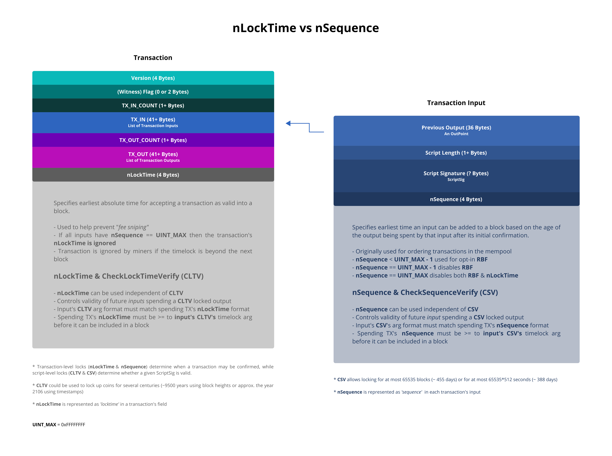

# Timelocks Summary

Bitcoin allows the ability to have it's transactions encumbered by explicit absolute or relative timelocks, through transaction-level or script-level locks by specifying either block heights or timestamps. These locks control the validity of an entire transaction or a specific transaction input. The transaction-level locks are determined by the values in the locktime field (`nLockTime`) of a transaction and the sequence field of each input in a transaction (`nSequence`). This functionality is in addition to their existing uses to help prevent [*fee sniping*](https://github.com/bitcoin/bitcoin/pull/2340) for example in the case of `nLockTime`, and signaling [opt-in RBF](https://github.com/bitcoin/bips/blob/master/bip-0125.mediawiki) or ignoring the `nLocktime` in the case of `nSequence`.

> Note: `nSequence` was originally envisioned to be used for ordering unconfirmed transactions in the mempool, however, it was given a new lease on life in [BIP 68](https://github.com/bitcoin/bips/blob/master/bip-0068.mediawiki) to supplement it's existing use case(s) to include timelocks.



For more granular control over a transaction's outputs, [BIP 65](https://github.com/bitcoin/bips/blob/master/bip-0065.mediawiki) and [BIP 112](https://github.com/bitcoin/bips/blob/master/bip-0112.mediawiki) were introduced to allow embedding the timelock in a transaction's script, these script operator codes are `OP_CheckLockTimeVerify` (`OP_CLTV`) and `OP_CheckSequenceVerify` (`OP_CSV`) respectively. Both allow individual transaction outputs and not entire transactions to be restricted by either an absolute or relative timelock or both. They force the `nLockTime` or `nSequence` values in a transaction spending `OP_CLTV` and or `OP_CSV` locked outputs to be set to a value greater than or equal to the timelock of their operator arguments.

The key difference between `OP_CLTV` and `OP_CSV` has been nicely summed up by [Nicolas Dorier on Reddit](https://www.reddit.com/r/Bitcoin/comments/5i1ax7/nsequencenlocktime_vs_checksequenceverify_vs/db4vo9j/?context=3):

```
With CheckSequenceVerify you can say: I want this output to be spendable when it has X confirmation. (relative to time of mining)

With CheckLocktimeVerify you can say: I want this output to be spendable at height X. (absolute time)
```

It is also possible to lock a particular output with both an absolute and relative timelock, in which case the following could be an example scenario:

```
I want this output to be spendable after time X and after Y confirmations.
```

## Useful links

### Articles & Wikis

[Timelock](https://en.bitcoin.it/wiki/Timelock) `wiki`

[Bitcoin Time Locks](https://medium.com/summa-technology/bitcoins-time-locks-27e0c362d7a1) `article`

[Bitcoin Timelocks in a nutshell](https://medium.com/@RobinHung/bitcoin-timelocks-in-a-nutshell-4c95aafc7a59) `article`

### StackExchange and Reddit

[What does the sequence in a transaction input mean?
](https://bitcoin.stackexchange.com/questions/87372/what-does-the-sequence-in-a-transaction-input-mean/87376#87376) `stackexchange`

[CLTV vs NLockTime](https://bitcoin.stackexchange.com/questions/71916/cltv-vs-nlocktime) `stackexchange`

[nSequence/nLocktime vs CHECKSEQUENCEVERIFY vs CHECKLOCKTIMEVERIFY](https://www.reddit.com/r/Bitcoin/comments/5i1ax7/nsequencenlocktime_vs_checksequenceverify_vs/) `reddit`

## Addendum

[1] The terms "*transaction-level*" and "*script-level*" refer to where the encumbrance rules are specified or found in a transaction's structure; "*transaction-level*" refers to the fields in a transaction, while "*script-level*" refers to instructions set in the transaction's locking script (i.e. ScriptPubKey).

[2] The `n` in `nSequence` and `nLockTime` stands for 'number'.

  > "*The concept of prefixing variable names with information about their type is called Hungarian notation. It was common in Windows programming in the '90s, and now is generally considered a bad idea.*" - [Pieter Wuille](https://bitcoin.stackexchange.com/questions/91529/what-does-the-n-in-nlocktime-and-nsequence-stand-for#comment104813_91530)

---

MIT &copy; Zero-1729
